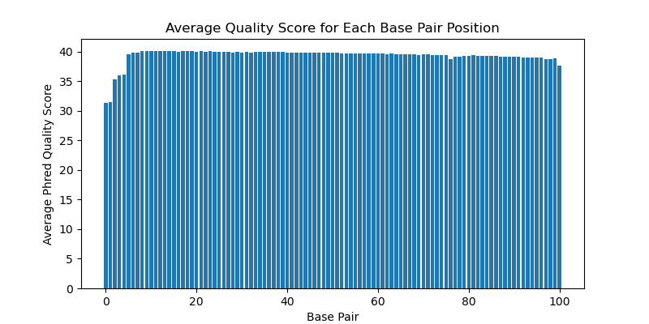
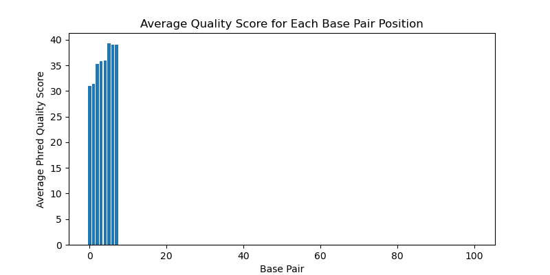
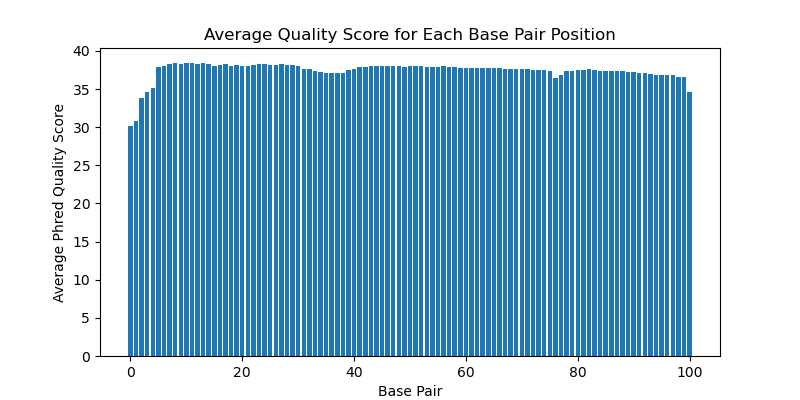

# Assignment the First

## Part 1
1. Be sure to upload your Python script. Provide a link to it here: [quality_dist.py](./quality_dist.py)

| File name | label | Read length | Phred encoding |
|---|---|---|---|
| 1294_S1_L008_R1_001.fastq.gz | read1 | 101 | phred+33 |
| 1294_S1_L008_R2_001.fastq.gz | index1 | 8 | phred+33 |
| 1294_S1_L008_R3_001.fastq.gz | index2 | 8 | phred+33 |
| 1294_S1_L008_R4_001.fastq.gz | read2 | 101 | phred+33 |

2. Per-base NT distribution
    1.  
    R1:
     
    R2:  
     
    R3:  
      
    R4:  
    
    2. I think a quality score of 34 would be a good cutoff for both index reads because it is abotu the average of the position averages. For biological read pairs, I would use a cutoff of 36 since most of the position averages are above that, but 36 is still a decent score.
    3. command: ```zcat 1294_S1_L008_R2_001.fastq.gz 1294_S1_L008_R3_001.fastq.gz | sed -n '2~4p' | grep -E "N" | wc -l```  
    answer: 7304664
    
## Part 2
1. Define the problem
2. Describe output
3. Upload your [4 input FASTQ files](../TEST-input_FASTQ) and your [>=6 expected output FASTQ files](../TEST-output_FASTQ).
4. Pseudocode
5. High level functions. For each function, be sure to include:
    1. Description/doc string
    2. Function headers (name and parameters)
    3. Test examples for individual functions
    4. Return statement

made Pseudocode.md for part 2
